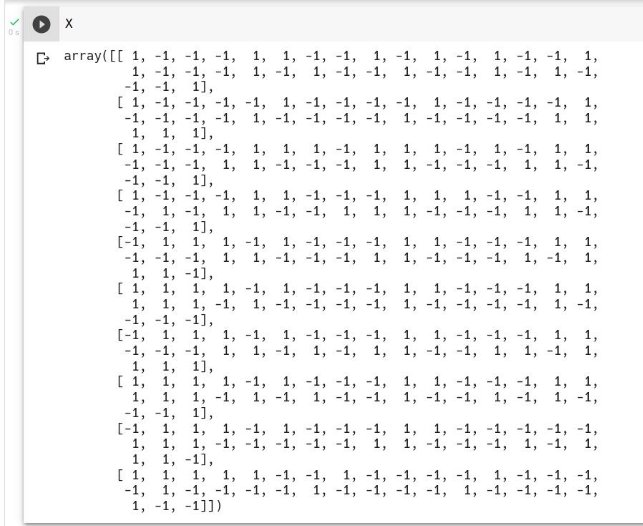
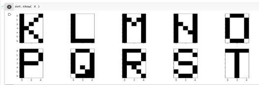
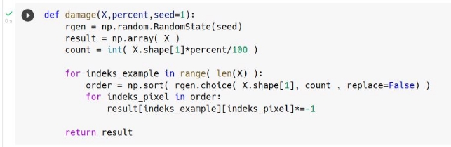
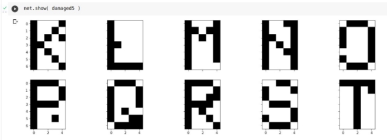
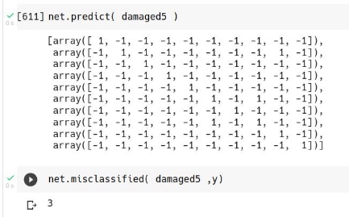
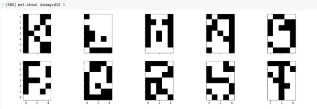
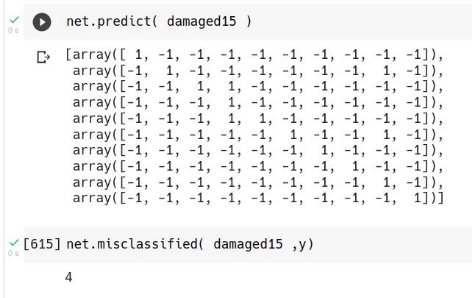
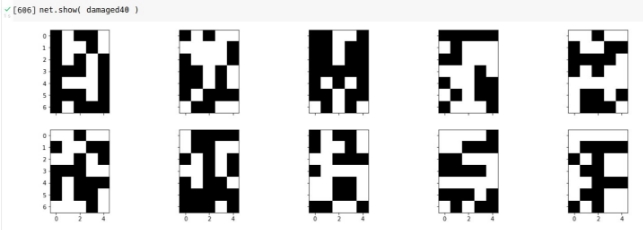
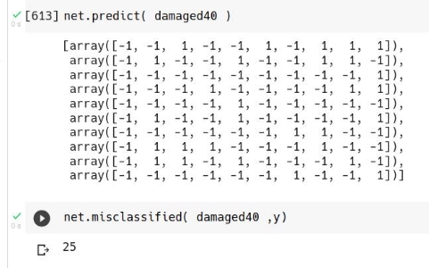

**Perceptron + letters**

1. Przygotować kod klasy **SLP** (Single Layer Perceptron). Klasa powinna posiadać metody:

***def \_\_init\_\_(self, eta=0.05, n\_iter=10, random\_state=1): def fit(self, X, y):***

***def predict(self, X):***

***def misclassified(self, X):***

***def show(self, X):***

Obiekt tej klasy w momencie wywołania metody fit automatycznie dopasowuje architekturę sieci do zbioru X (tworzy obiekty wykonanej w trakcie zajęć klasy Perceptron w ramach pojedynczej warstwy) oraz przeprowadza uczenie.

2. Utworzyć obiek klasy **SLP** o nazwie **net**. Pozostawić domyślne wartości parametrów **eta** i **n\_iter**. ***net = SLP()***
2. Wczytać dane z pliku letters.data i wybrać z nich **tylko te przypadki (i powiązane z nimi odpowiedzi) wskazane w indywidualnym zestawie danych *set*.**
2. Podzielić indywidualne dane na zbiory X oraz y. Pełny zbiór letters.data składa się z przykładów podanych w wierszach. Pierwsze 35 wartości każdego wiersza stanowią wartości 35 pikseli kodujących literę. Litery zakodowano na siatce o szerokości 5 pikseli i wysokości 7 pikseli. Kolejne 26 wartości koduje wektor odpowiedzi oczekiwanej na wyjściu sieci.

**Poniżej przykład zbiorów X i y dla zbioru indywidualnego set=[10,11,12,13,14,15,16,17,18,19]:**

**Zawartość X:**

**Zawartość y:**

5. Wyświetlić graficznie dane z indywidualnego zbioru X korzystając z zaimplementowanej metody show. **Poniżej przykład dla zbioru indywidualnego set=[10,11,12,13,14,15,16,17,18,19]:**

6. Przeprowadzić uczenie modelu wywołując ***fit(X,y)***. *net.fit(X,y)*
6. Wyświetlić wynik predict na zbiorze uczącym.

**Poniżej przykład dla zbioru indywidualnego set=[10,11,12,13,14,15,16,17,18,19]:**

8. Wyświetlić zawartość errors\_.

**Poniżej przykład zbiorów X i y dla zbioru indywidualnego set=[10,11,12,13,14,15,16,17,18,19]:**

9. Wyświetlić wynik misclassified na zbiorze uczącym.

**Poniżej przykład zbiorów X i y dla zbioru indywidualnego set=[10,11,12,13,14,15,16,17,18,19,20]:**

10. Korzystając z funkcji damage uszkodzić kolejno 5%, 15%, 40% każdego przypadku z indywidualnego zbioru X.

11. Wyświetlić graficznie dane z każdego uszkodzonego zbioru oraz wyniki predict i misclassified.

12. Kod wynikowy zapisać w formie pliku ***perce\_own.ipynb*** (zeszytu Colab).
12. Dokumentację przebiegu zadania i otrzymanych wyników zapisać w formie pliku ***perce\_own.pdf***. Elementy konieczne dokumentacji to te, których dotyczą zrzuty ekranu. Pamiętajmy o odpowiednich tytułach/podpisach.
12. Ponowić operacje korzystając z implementacji perceptronu biblioteki ***scikit-learn***.
12. Kod wynikowy zapisać w formie pliku ***perce\_scikit.ipynb*** (zeszytu Colab).
12. Dokumentację przebiegu zadania i otrzymanych wyników zapisać w formie pliku ***perce\_scikit.pdf***.
12. Wskazane powyżej pliki zapakować do formy archiwum zip (bez hasła) i przesłać na skrzynkę na kampusie. Nazwa archiwum składać się musi z nazwiska oraz imienia autora (bez polskich znaków) oddzielonych podkreślnikiem.

Przykład: **olszewski\_pawel.zip**
